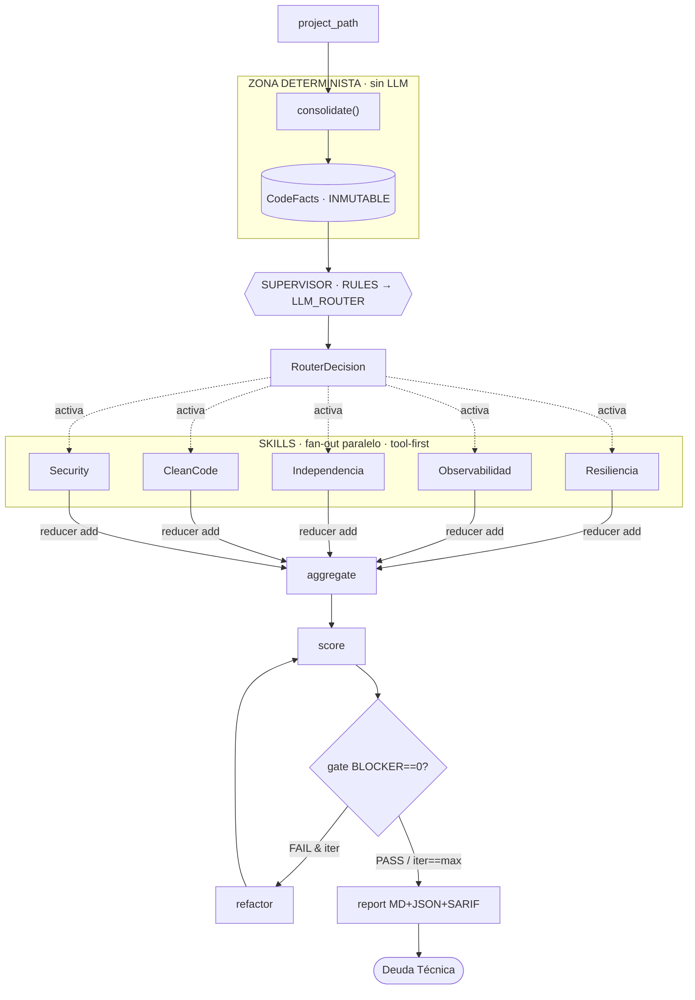

# Plan de Construcción — Golden-Standard Microservice Guard (GSMG)

Sistema **híbrido determinista/LLM** para verificar el cumplimiento del *Golden
Standard* de microservicios (Resiliencia, Observabilidad, Independencia de
datos, Clean Code, Security).

> Principio rector: **los hechos se producen sin LLM** (parsers AST,
> reproducibles, coste 0). El LLM solo **decide y redacta** sobre evidencia ya
> verificada. Frontera dura entre la zona determinista y la cognitiva.

## Decisiones de arquitectura tomadas

1. **Paquete base único: `gsmg/`.** `javaarch_guard/` queda solo como referencia
   del patrón de grafo y se borrará tras la migración.
2. **`SECURITY` es un skill propio** (secrets, endpoints sin auth, actuator
   inseguro), no un subconjunto de Clean Code.
3. **Primer hito de construcción: cerrar la capa determinista** (coste 0,
   testeable sin tokens).

## Estado actual

| Componente | Estado | Ubicación |
|---|---|---|
| Extracción determinista (Java/Pom/Gradle/Config/Logback) | ✅ | `gsmg/extract/*` |
| Consolidador → `CodeFacts` | ✅ | `gsmg/extract/consolidator.py` |
| `imports_graph` módulo→módulo | ✅ | `consolidator.py` (`_resolve_import_module`) |
| State tipado por pilares | ✅ | `gsmg/state.py` |
| Tests sobre fixtures | ✅ | `tests/` (38 passing) |
| `lint_raw` (Checkstyle/PMD) | 🔨 | — |
| `secrets_scan_raw` (gitleaks) | 🔨 | — |
| Grafo LangGraph + Supervisor | 🔨 | `gsmg/graph.py` (a crear) |
| Skills (RESILIENCE/OBSERVABILITY/DATA_INDEP/CLEANCODE/SECURITY) | 🔨 | — |
| score / gate / report (MD/JSON/SARIF) | 🔨 | — |

## Flujo

## Routing

- **Supervisor determinista por defecto** (reglas sobre `facts`), LLM_ROUTER solo
  ante ambigüedad (`framework=UNKNOWN`, señales en conflicto). El LLM elige de un
  **enum cerrado `Pillar`** — no puede inventar skills.
- **Quality gate 100% determinista**: reintento solo si `iteration < max_iterations`.
  La terminación NUNCA depende del LLM.

## Validación final

`aggregate` (dedup por fingerprint, TOOL gana a LLM) → `score`
(`debt_score`, `pillar_scores`, conteos; pesos `BLOCKER=40 CRITICAL=20 MAJOR=8
MINOR=3 INFO=0`) → `gate` (`BLOCKER>0 ⇒ FAIL`) → `report` (MD legible + JSON +
SARIF para anotar inline en code review). Cada `Finding` lleva
`source: TOOL|LLM|HYBRID` para auditar máquina vs. modelo.

## Roadmap

1. ✅ Cerrar capa determinista — `imports_graph` (hecho); 🔨 `lint_raw`, `secrets_scan_raw`.
2. Grafo `gsmg/graph.py` + Supervisor (capa RULES primero).
3. Skills por ROI determinista: OBSERVABILITY, RESILIENCE → DATA_INDEP → CLEANCODE → SECURITY.
4. score / gate / report.
5. Borrar `javaarch_guard/`; entrypoint único `gsmg`.
