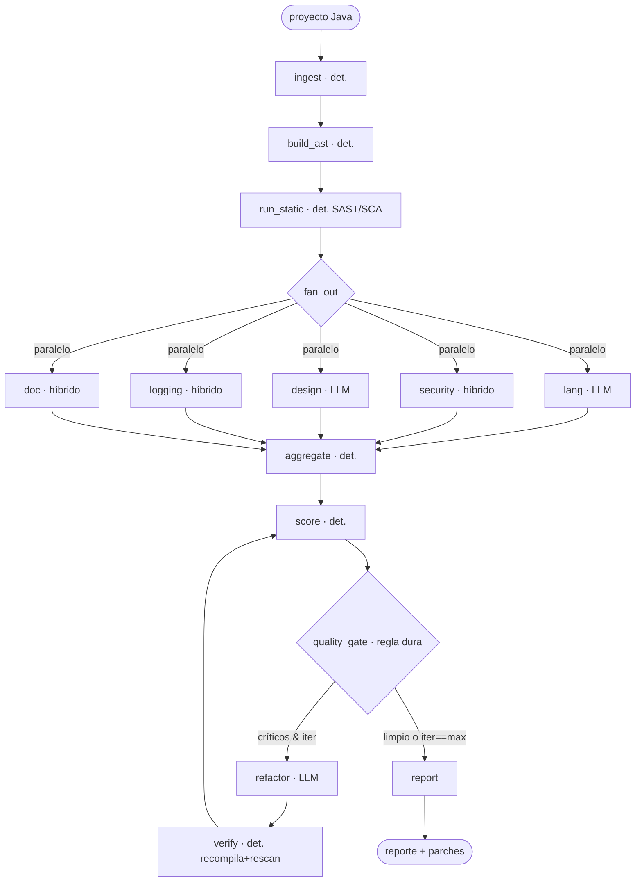

# JavaArch-Guard

Guardián de Arquitectura y Deuda Técnica para proyectos **Java**, rediseñado como
un sistema **híbrido determinista** orquestado con **LangGraph**.

La premisa de diseño: *detección de hechos = código determinista; juicio
semántico = LLM*. La decisión de iterar el bucle de corrección es una **regla
dura**, nunca una salida del modelo. Esto da reproducibilidad y minimiza la
aleatoriedad del LLM.

## Flujo del grafo



## Dimensiones de análisis

| Dim | Determinista | LLM |
|-----|--------------|-----|
| **LANG** | — | records, streams, sealed, excepciones, concurrencia |
| **SECURITY** | Semgrep OWASP, Dependency-Check, detect-secrets | triage / explotabilidad |
| **DESIGN** | — | SOLID, DI, acoplamiento, patrones |
| **LOGGING** | `System.out`, niveles | PII, semántica de mensajes |
| **DOC** | cobertura Javadoc | calidad de contratos |

## Uso

```bash
pip install -e .
pip install semgrep detect-secrets          # herramientas deterministas
export ANTHROPIC_API_KEY=sk-...              # opcional: sin clave corre solo lo determinista
python -m javaarch_guard /ruta/proyecto --out reporte.md --gate 30
```

Salida: `reporte.md` y código de salida `1` si quedan críticos o el debt_score
supera el umbral (apto para bloquear merges en CI).

## Tareas automatizadas (CI/CD)

- La Action `.github/workflows/archguard.yml` corre sobre cada PR que toca `.java`.
- El `debt_score` actúa como *status check* que bloquea el merge.
- Recomendado: cachear resultados SAST por hash de archivo y escanear solo el diff.

## Tests

```bash
pytest                       # o el runner manual sin deps
```

Los tests deterministas no requieren API key.
